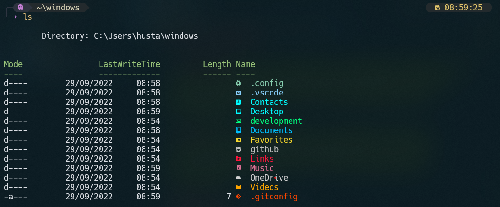

<p align="center">

<div align="center">

## My dotfiles Windows 

</div>

<spam>
Welcome to a junior programmer's personal collection of configurations inside Windows.
You can feel free to steal anything from here, but don't forget to give me credits :). 
</spam>

</p>

<br>

<div align='center'>

[](https://)
[](https://)
[](https://)
[](https://)

</div>

### Structure

```
$env:USERPROFILE\.config
└──── powershell  
    │   # config file
    ├── user_profile.ps1
    │   # prompt customizations
    └── my.omp.json
```
### Information

Here are some details about my setup:

*   **OS:** [Windows 11](https://www.microsoft.com/es-es/software-download/windows11)
*   **Terminal:** [Windows Terminal](https://github.com/microsoft/terminal)
*   **Shell:** [PowerShell](https://learn.microsoft.com/en-us/powershell/)
*   **Editor:** [neovim](https://neovim.io/) / [vscode](https://code.visualstudio.com/)

### Requirements

* **Icons:** [Material Design Icons](https://pictogrammers.com/libraries/)

**Modules**

<details>

<summary>🎏 oh-my-posh & posh-git</summary>

```powershell
winget install JanDeDobbeleer.OhMyPosh -s winget

Install-Module posh-git -Scope CurrentUser -Force
Install-Module oh-my-posh -Scope CurrentUser -Force
```
</details>
<details>
<summary>🎄 Terminal-Icons</summary>

```powershell
Install-Module -Name Terminal-Icons -Repository PSGallery -Force
```
</details>

**Current User**

<details>
<summary>Edition</summary>
```powershell
nvim .\user_profile.ps1
nvim $PROFILE.CurrentUserCurrentHost
```
append content
```powershell
. $env:USERPROFILE\.config\powershell\user_profile.ps1
```
</details>

**Scoop**

<details>

<summary>List installed apps</summary>

apps:
    `bat`, `gsudo`, `cur`, `glow`, `ttyper`, `unrar`, `7zip`, `zip`
```powershell
scoop install app
```

</details>


### Gallery


